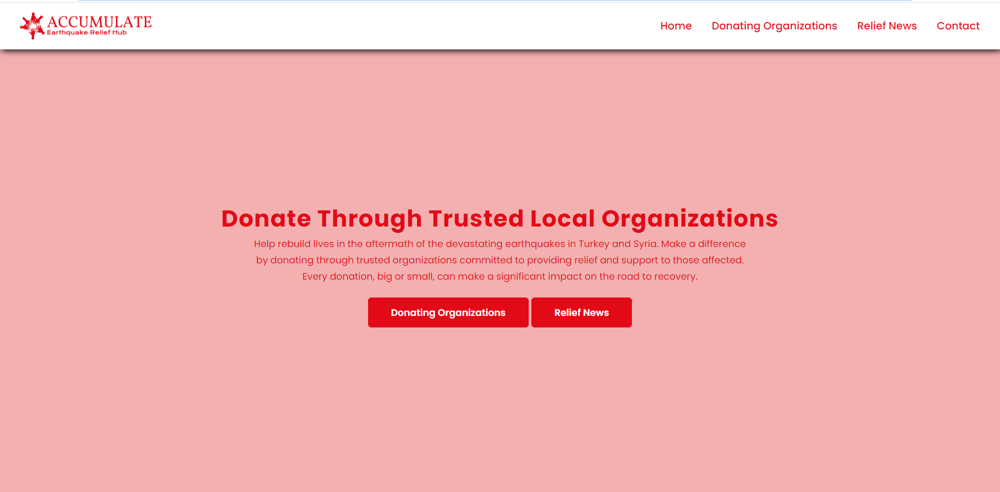

# accumulate
An NGO project listing down trusted and local donating organizations working towards earthquake relief support in Turkey and Syria

# Accumulate - Earthquake Relief Support

The Website lists downs trusted and verified local organizations on ground and working towards donation and relief support for post earthquake disaster in Turkey and Syria

## Organizations Listed
- Turk Kizilay
- Molham Team
- IHH
- AFAD
- White Helmets
- LaunchGood
- Yeryuzu Cocuklari
- AKUT
- AHBAP
- KAN

# Sections
- Navigation Page
- Home Page
- Donating Organizations List Page
- Contact Page
- Hamburger menu
- Interactive on different devices
