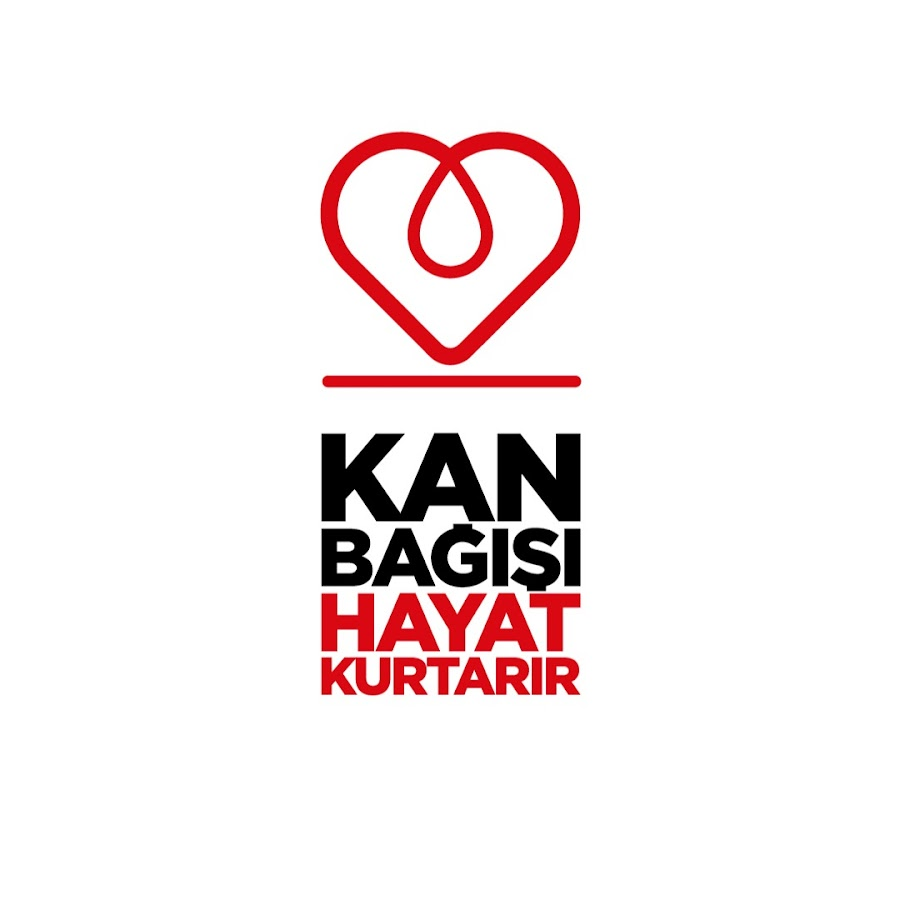

# accumulate
An NGO project listing down trusted and local donating organizations working towards earthquake relief support in Turkey and Syria

# Accumulate - Earthquake Relief Support

The Website lists downs trusted and verified local organizations on ground and working towards donation and relief support for post earthquake disaster in Turkey and Syria

## What we will learn
- Importance of Basic HTML CSS & JS.
- Create Project Directory
- Create Navigation Bar
- Create Home Section
- Create Feature Section
- Create Popular Courses Section
- Create Registration Form
- Create Profile Section
- Create Footer Section
- Website Debugging
- Make Responsive Website For Tablet
- Make Responsive Website For Mobile

# Sections
- Home Page
- About Page
- Blog Page
- Single Post
- Course Page
- Single Course
- Contact Page

Here you will find all the images I'm using to create this responsive lms website. In future, image folder can update.

Get the full source code from [here1](https://www.buymeacoffee.com/tech2etc/e/42638).

Get the full source code from [here2](https://ko-fi.com/s/9c53d5b08b).
